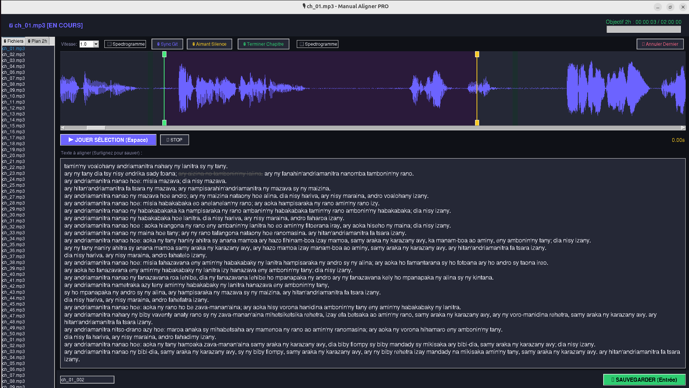

# 🎙 Malagasy Audio-Text Manual Aligner (PRO)



Station de travail haute performance pour l'alignement manuel de la Bible en Malgache. Optimisée pour la création de jeux de données (datasets) de 2 heures destinés à l'entraînement de modèles de type TTS ou STT.

## ✨ Fonctionnalités Clés
- **Visualisation Double** : Waveform et Spectrogramme interactifs.
- **Smart Seeking** : Estimation automatique des marqueurs audio basée sur le texte sélectionné.
- **Optimisation IA** : Algorithme de sélection des 2 heures les plus riches linguistiquement.
- **Workflow Collaboratif** : Synchronisation légère via Git (partage des métadonnées uniquement).
- **Scripts Utilitaires** : Nettoyage d'audio et reconstruction automatique du dataset.

## 🛠 Installation

### 1. Prérequis Système
Vous devez avoir **FFmpeg** installé pour gérer les fichiers audio et la lecture.

```bash
# Sur Ubuntu/Linux
sudo apt update && sudo apt install ffmpeg
```

### 2. Dépendances Python
Installez les bibliothèques nécessaires :

```bash
pip install pydub numpy pillow scipy
```

## 🚀 Utilisation

### 1. Préparation (Collaborateurs)
Placez vos fichiers audio `.mp3` dans le dossier `audio/` (en respectant la structure : `audio/AT/Livre/chapitre.mp3`). Les dossiers lourds sont exclus du Git par défaut.

### 2. Lancement
```bash
python3 aligner.py
```

### 3. Workflow d'Alignement
1. **Plan 2h** : Allez dans l'onglet "Plan 2h" à gauche. 
2. **Action** : Cliquez sur une phrase suggérée. L'audio et le texte se chargeront directement à la bonne position.
3. **Ajustement** : Ajustez les marqueurs vert/orange fin à l'oreille ou avec le spectrogramme.
4. **Validation** : Surlignez le texte correspondant avec la souris et appuyez sur **Entrée** (ou bouton Sauvegarder).
5. **Marquage** : Quand la phrase du plan est finie, marquez-la comme "Succès" (étoile ⭐).

### ⌨️ Raccourcis Claver
- **Espace** : Jouer / Arrêter la sélection.
- **Entrée** : Sauvegarder le segment.
- **Q / W** : Ajuster finement le marqueur de DÉBUT.
- **E / R** : Ajuster finement le marqueur de FIN.
- **Flèches Relatif** : Navigation temporelle ultra-fine dans l'audio.

## 👥 Travail en Groupe (Git)

Ce projet est conçu pour la collaboration :
1. **Push** : À la fin de votre session, poussez vos fichiers `dataset/alignment_data.json` et `dataset/metadata.csv` sur GitHub.
2. **Pull** : Quand vous récupérez le travail d'un collègue, cliquez sur le bouton **🔄 Sync Git** dans l'appli pour voir ses ✅ apparaître.
3. **Reconstitution** : Pour générer physiquement les fichiers `.wav` des segments faits par vos collègues, lancez :
   ```bash
   python3 rebuild_dataset.py
   ```

## 🧹 Maintenance
Pour supprimer les fichiers audio qui ne font pas partie du plan de 2h et gagner de la place :
```bash
python3 clean_audio.py
```

---
*Note : Le dataset source complet est disponible sur [Votre Lien Drive].*
